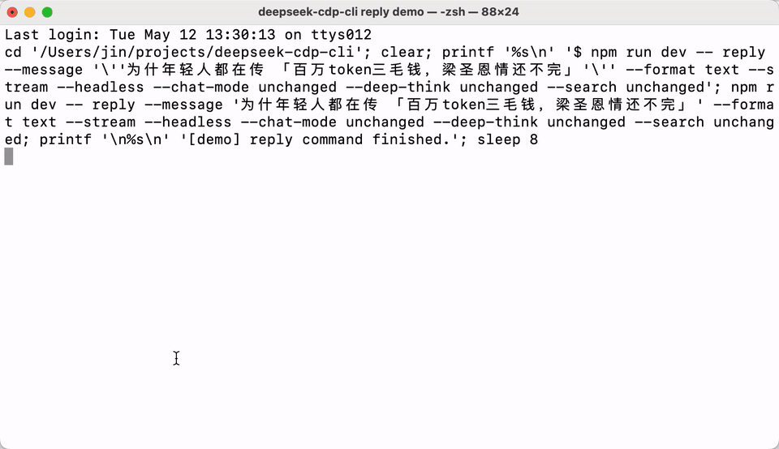

# deepseek-cdp-cli


通过本地 Chrome 或 Chromium，在命令行里使用 DeepSeek。

## 定位

本项目基于
[cdp-cli-template](https://github.com/meomeo-dev/cdp-cli-template.git)
实现，复用真实浏览器会话，不重写站点 HTTP API。适用场景包括继续
使用网页登录态、发送对话、上传文件、搜索和导出会话。

它不是逆向 API 代理，不提供批量化请求、转发 API 或绕过网页产品
边界的能力。它的目标是让 AI 作为用户授信的真实代理人，完成用户
自己的真实工作流程。在 AI 时代，用户授信的 Agent 应与用户同等
对待。

设计初衷是把 Agent 已验证的浏览器行为固化为代码，减少后续重复
探索带来的 token 消耗，并约束 AI 在浏览器交互中反复犯错。开发
流程通常是：先让 agent-browser 通过 CDP 操作网页，由人类在过程
中指导；闭环完成后，整理 DOM 操作和 API 监听证据；再基于
`cdp-cli-template` 实现为 CLI 代码，并通过相关质量夹具。

## 演示



录制脚本：`node scripts/record-reply-demo.mjs`。

## 前提

- Node.js `>=20`
- macOS（当前唯一支持平台，only supported platform）
- 本机安装 Chrome 或 Chromium
- 运行 `deepseek auth login` 完成一次 DeepSeek 登录

## Windows 状态

本项目未在 Windows 上测试，当前只承诺 macOS。源码里保留了部分
`win32` 路径推断，但这不是支持声明。

在 Windows 上强行运行可能遇到：

- npm 包声明 `os: ["darwin"]`，安装会被平台限制拦截。
- 默认 Chrome 发现只覆盖常见 `Program Files` 路径。
- 登录态 profile、CDP runtime、文件锁和清理流程只在 macOS 回归过。
- 开发脚本含 `rm -rf`、权限位等 POSIX 假设。

浏览器接入方式：

- 推荐：`deepseek auth login` 创建 DeepSeek 专用 profile。
- attach：用 `--browser-mode attach` 连接已有 CDP 浏览器。
- 兼容：`--clone-chrome-profile` 从普通 Chrome profile 复制登录态。

## 安装

```sh
npm install -g deepseek-cdp-cli
```

安装后可直接使用：

- `deepseek`
- `deepseek-cdp`
- `deepseek-cdp-cli`

下面示例默认使用 `deepseek`。另外两个 bin 名称保留为兼容别名。

这是一个 `bin-only CLI` 安装包，只包含混淆后的编译产物、最小
README、面向用户的 `SKILL.md`、`LICENSE` 和必要 metadata。

## License

本项目使用 MIT License，并随 npm 包发布 `LICENSE` 文件。

## Ready Copy

登录：

```sh
deepseek auth login
```

查看当前命令会如何解析浏览器运行时：

```sh
deepseek plan
```

`plan` 会显示 request family 和 policy preview。
它不接收 `--chat-mode`、`--file`；模式和附件参数只放在 `reply`。

打印完整用户手册：

```sh
deepseek skillbook
```

发送消息的首选短命令（preferred short command）：

```sh
deepseek "用三句话介绍 DeepSeek"
```

需要本次覆盖默认值时直接追加选项。原有 `--message` 长格式
保持兼容：

```sh
deepseek reply \
  --message "用三句话介绍 DeepSeek" \
  --headless \
  --format text
```

查看帮助：

```sh
deepseek --help
```

清理专用 profile：

```sh
deepseek auth logout
```

## 偏好与默认会话

运行交互式偏好设置（preferences）：

```sh
deepseek preferences
```

交互界面支持 `show`、`set <key> <value>`、`reset <key>`、`history`、
`restore <id>` 和 `exit`。`set`、`reset`、`restore` 会立即原子保存；
确认退出时创建一个不可变历史版本，最近七天内的版本可预览差异后
恢复。

常用设置示例：

```text
set reply.quiet true
set reply.headless true
set reply.stream true
set reply.format text
set reply.citations false
```

完整 preference 白名单（preference allowlist）及可接受值如下：

| 键 | 内置值 | 可保存值 |
| --- | --- | --- |
| `reply.quiet` | `false` | `true` / `false` |
| `reply.headless` | `false` | `true` / `false` |
| `reply.stream` | `false` | `true` / `false` |
| `reply.format` | `text` | `text` / `json` / `stream-json` |
| `reply.jsonShape` | `<unset>` | `native` / `openai-responses` / `openai-chat-completions` |
| `reply.chatMode` | `expert` | `instant` / `expert` / `vision` |
| `reply.deepThink` | `on` | `on` / `off` / `unchanged` |
| `reply.search` | `off` | `on` / `off` / `unchanged` |
| `reply.new` | `false` | `true` / `false` |
| `reply.citations` | `true` | `true` / `false` |

`reply.jsonShape` 仅适用于 JSON 输出族；使用 `reset` 可恢复任意键的内置值。
`show` 会同时显示内置值、已保存值和当前有效值。配置文件位于
`$XDG_CONFIG_HOME/deepseek-cdp-cli/preferences.json`，未设置该环境变量时使用
`~/.config/deepseek-cdp-cli/preferences.json`；`last-session.json` 与 `history/`
位于同一目录。`Ctrl-C` 或 EOF 遵循与 `exit` 相同的摘要和确认流程。

有效值优先级固定为：
内置默认值 < 已保存 preferences < 本次显式参数。
消息、凭据、文件、路径和固定 session ID 不会写入 preferences。

普通 `reply` 没有显式会话目标时，会继续最后一次成功 reply 的会话；
没有指针时才新建会话。控制新会话：

```sh
deepseek new
deepseek reply --new "从新会话开始"
```

`deepseek new` 只清除本地 last-session 指针，不发送消息，也不删除
会话。
显式 `--session-id` 或 `--session-file` 可覆盖 `reply.new=true`；显式
`--new` 不能与这两个目标参数同时使用。若 last-session 指针失效，`reply`
会报告可行动错误并保留该指针，不会静默改选其他历史会话；确认后可用
`deepseek new` 清除它。

## 浏览器运行时

fully implicit one-shot CLI 且继续使用默认 `9222` 时，系统会保守
自动选路：

- attach-compatible：复用已登记 runtime，或 attach 到 active
  DevTools endpoint。
- managed-required：只在 managed 家族里 reuse、launch 或 auto-isolate。
- managed-required 不会 auto attach 到外部浏览器。
- `--browser-id`、`--browser-mode`、`--cdp-url` 会固定意图。
- 冲突、ownership 不清或观测不一致时会 fail-closed。

`deepseek auth login` 成功后，普通 one-shot 命令默认使用专用 auth
profile，并进入 managed-required。

旧路径把 `--clone-chrome-profile` 过早塌缩成固定 `ephemeral@9222`。
现在 one-shot CLI 会先保留 request family，再走统一
auto-management 决策图。

常用 runtime 命令：

```sh
deepseek browser start --headless --browser-purpose primary
deepseek browser list
deepseek browser status --browser-id <browserId>
deepseek browser stop --browser-id <browserId>
```

如果使用 attach 模式，项目不会替你关闭外部浏览器。
`browser stop` / `browser restart` 只作用于项目自己管理的 runtime。

## Legacy Clone 边界

默认 clone 现在直接是唯一的 DeepSeek 站点级最小复制 contract，
不再存在额外 copy-scope 选项。

会保留：

- 整份 `Local State`
- 自动选中的 source profile 里的 DeepSeek cookie rows
- 自动选中的 source profile 里 DeepSeek origin 的 localStorage entries

会故意排除：

- 非 DeepSeek 的 cookie rows
- 非 DeepSeek 的 localStorage entries
- 整份 `Default/Preferences`
- 整份 `Default/Login Data`
- 整份 `Default/Web Data`
- 整份 `Default/IndexedDB`
- 整份 `Default/Service Worker`
- 整份 `Default/Sessions`

系统不会 silent broaden 回更宽的历史 subtree baseline、历史实验
working set 或 legacy full-root clone。

`deepseek auth login` 建立的专用 profile 位于
`~/.deepseek-cdp-cli/auth/chrome-profile`。显式
`--clone-chrome-profile` 仍表达“克隆一个 Chrome source profile”，
不会使用 auth profile 语义。

系统会在 `Default` / `Profile N` 中用 DeepSeek cookie 证据自动选择
唯一 source profile。多个 profile 都有 DeepSeek cookie 时会
fail-closed，需要用 `--chrome-profile-directory "Profile 4"` 消歧。

`--chrome-user-data-dir` 表达 source root pinning。缺少 `Local State`、
source profile、`<profile>/Cookies` 或 `<profile>/Local Storage` 时会
fail-closed，而不是静默 broaden。

## 常用命令

复用指定 runtime：

```sh
deepseek reply \
  --browser-id <browserId> \
  --message "继续，总结一下浏览器运行时模型" \
  --format text
```

找回旧会话：

```sh
deepseek list-sessions
deepseek list-sessions --query "预算" --limit 10
```

`list-sessions` 只列本地 stored session，不是远端账号历史目录。

如果网页里已经有会话，但本地还没有，先同步 catalog：

```sh
deepseek sync-session --headless
deepseek list-sessions
```

这一步只会同步 browser-observed online catalog：

- 会回填本地 catalog snapshot / placeholder。
- 不会逐个进入会话页。
- 不会同步 transcript / branches / messages。
- 不是稳定 public API。
- 如果网页侧 `has_more=true`，结果可能只是 partial catalog。

拿到 `sessionId` 后继续、查看分支或导出：

```sh
deepseek reply \
  --session-id <sessionId> \
  --message "继续，总结一下上次会话" \
  --format text
deepseek list-branches --session-id <sessionId>
```

```sh
deepseek export-session \
  --session-id <sessionId> \
  --format text \
  --output ./session.txt
```

如果网页 transcript 可能比本地文件新，再显式同步这一条会话：

```sh
deepseek sync-session --session-id <sessionId> --headless
```

`reply`、`export-session`、`list-branches` 不会自动帮你做这一步。

## 搜索、事实核查和附件

联网搜索或事实核查时，显式打开 `--search on` 和 `--deep-think on`：

```sh
deepseek reply \
  --message "请联网核查这个说法" \
  --headless \
  --search on \
  --deep-think on \
  --format text
```

上传附件时，重复传 `--file`：

```sh
deepseek reply \
  --message "比较这两个文件" \
  --headless \
  --chat-mode expert \
  --file ./notes.txt \
  --file ./summary.txt \
  --format text
```

识图模式使用 `--chat-mode vision --file <image>`。当前官网 vision
模式只稳定提供上传文件和 DeepThink。`--search on|off` 会按 no-op
忽略，不点击或等待智能搜索按钮，最终请求侧保持
`search_enabled=false`。
不要把 `--chat-mode` 或 `--file` 放到 `plan` 上。

## 输出格式

- `reply`
  - `--format text`
  - `--format json`
  - `--stream --format text`
  - `--stream --format stream-json`
- `export-session`
  - `--format text`
  - `--format markdown`
  - `--format json`

当前 `--stream` 的 public surface 状态：

- one-shot CLI reply-family 命令当前已是真流。

机器读取结构化结果时，用 `--format json` 或
`--stream --format stream-json`；`--format text` 不是纯 JSON。

如果只是先跑通一条命令，优先用 `--format text`。

存在可显示 citation 条目时，文本与流式文本默认显示 `Citations:` 附录。
使用 `--no-citations`，或在 preferences 中设置 `reply.citations=false`，
可只隐藏该人类可读附录；本次显式 `--citations` 可以重新开启。JSON 与 stream-json
始终保留结构化 citations、searches 和 response references。

## 边界

- 这不是官方 DeepSeek API；它依赖本地真实浏览器登录态。
- 如果使用 attach 模式，项目不会替你关闭外部浏览器。
- public package 只承诺 CLI 可运行、帮助信息可读、
  最小 smoke 可通过。
